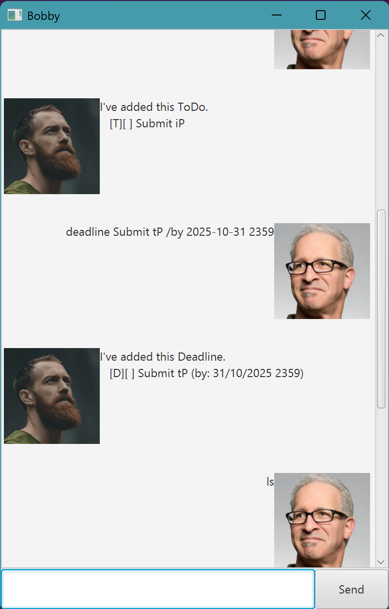

# Bobby User Guide



Bobby is a friendly chatbot designed to help users manage their tasks efficiently.

# Features
Notes about the command format
- Words in UPPER_CASE are the parameters to be supplied by the user. e.g. todo TASK_TO_ADD

## Feature todo
adds a todo task
Format: ```todo TASK_TO_ADD```


## Feature deadline
adds a deadline task
Format: ```deadline DEADLINE_TO_ADD /by YYYY-mm-DD HHMM```

## Feature event
adds an event task
Format: ```event EVENT_TO_ADD /from YYYY-mm-DD HHMM /to YYYY-mm-DD HHMM```

## Feature snooze
snoozes a deadline or an event
for deadlines:
Format: ```snooze TASK_NUMBER /by YYYY-mm-DD HHMM```

for events:
Format: ```snooze TASK_NUMBER /from YYYY-mm-DD HHMM /to YYYY-mm-DD HHMM```

## Feature list
shows the list of tasks
Format: ```list```

## Feature mark
marks a task as done
Format: ```mark TASK_NUM```

## Feature unmark
unmarks a completed task
Format: ```unmark TASK_NUM```

## Feature delete
deletes a task from the list
Format: ```delete TASK_NUM```

## Feature find
finds tasks that contain the search string within their descriptions
Format: ```find SEARCH_TERM```

## Feature bye
exits the chatbot
Format: ```bye```